  
    
  
    
  
    
  
    
  
   
  <a href="https://github.com/Gyan-775/Universe-flix-2.0" style="display:inline-block;margin-top:14px;padding:10px 22px;border-radius:999px;border:1px solid #67e8f9;background:linear-gradient(90deg,#0f172a,#1e1b4b);color:#e0f2fe;text-decoration:none;font-family:'JetBrains Mono',Consolas,monospace;font-weight:700;letter-spacing:0.8px;">VIEW UNIVERSE-FLIX →</a>
    
  
    
  
    
  
   
  

    <a href="YOUR_LINKEDIN_URL">LinkedIn (placeholder)</a> ·
    <a href="YOUR_INSTAGRAM_URL">Instagram (placeholder)</a> ·
    <a href="YOUR_X_URL">X (placeholder)</a>
  

  
Replace all three placeholder URLs above with your real LinkedIn, Instagram, and X links.

   
  

